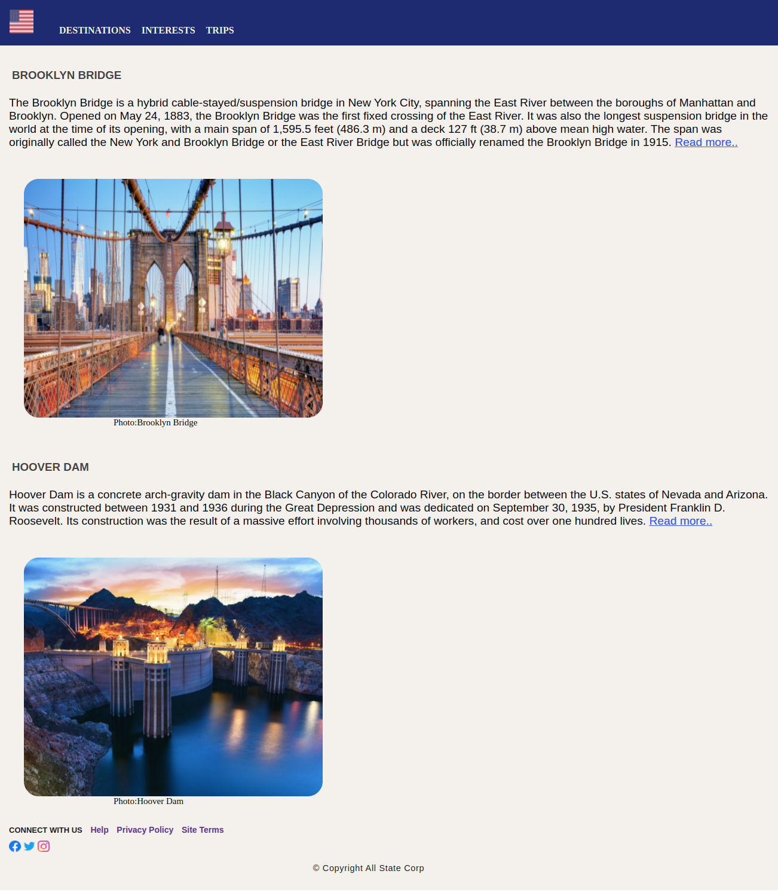

# Engineering Wonders of the United States of America

## Context

The United States is a land of unparalleled engineering achievements. From the majestic Brooklyn Bridge in New York to the Hoover Dam on the Arizona-Nevada border, America is home to some of the most awe-inspiring engineering feats in the world.

The Brooklyn Bridge is one of the oldest bridges in America, completed in 1883. It spans the East River, connecting Brooklyn and Manhattan. The bridge has been called an engineering marvel due to its construction techniques and the fact that it was the first bridge to span a major river.

The Hoover Dam is another engineering marvel. Completed in 1936, it spans the Colorado River and provides hydroelectric power to Arizona and Nevada. The dam is an impressive sight, standing over 700 feet high and containing over 12 million cubic yards of concrete.

## Problem Statement

Use CSS3 style properties to style the web page that lists down the two engineering wonders of the United States of America​​. 

Being a developer you are assigned with the task of styling the web page created in the previous practice that resembles the below image.

### Tasks

- The solution for this practice can be developed in 3 steps:​​​
    - Step 1: Define styles in `styles.css` file located in `css` folder of the boilerplate​​​
    - Step 2: Link the `styles.css` file with index.html​​ using `<link>` tag​
    - Step 3: Apply styles defined using class or id selector to the page elements

- In Step 1, following styles need to be defined in `style.css` of the web page.​
- 1: Styling header with navbar​
    - Background color should be midnightblue.​
    - Text font should be bold.​
    - Links in menu items should not be underlined.​
    - Font color of link items should be lightgoldenyellow.​
    - The Flag image should be sized 40px x 40px and have rounded corners.​
    - Margins and paddings should be defined to match the page output.
- 2: Styling content sections​
    Each section of the Engineering Wondes of the United States of America should have:​
    - Heading with bold font, dark gray color, and font family with options like Segoe UI, Tahoma, Geneva, Verdana, and sans-serif.​
    - Paragraph with font-family options like Gill Sans, Gill Sans MT, Calibri, Trebuchet MS, sans-serif and font size 1.2em​
    - Image with width 500px and height 400px with rounded border and image caption with font size 15px and left margin 150px​
    - Margins and paddings should be defined to match the page output
- 3: Styling footer​
    - Links in footer should not be underlined​
    - Social media icons should be of size 20px x 20px​
    - Footer link text should be of font-family Open Sans or generic font family sans-serif with font-size 14px​
    - Copyright text should be of font-family Open Sans or generic font family sans-serif with font-size .9em and color #171717​
    - Margins and paddings should be defined to match the page output

#### Details

Color codes used in the web page:
- #f4f1ec (entire document)
- midnightblue (header)
- lightgoldenellow (hyperlinks)
- #444 (headings in content sections)
- #171717 (copyright text)

Fonts used in this web page:
- Segoe UI, Tahoma, Geneva, Verdana, and sans-serif (headings in content sections)
- Gill Sans, Gill Sans MT, Calibri, Trebuchet MS, sans-serif (paragraphs in content sections)
- san-serif (footer content)

